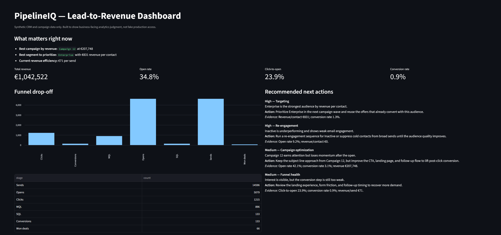
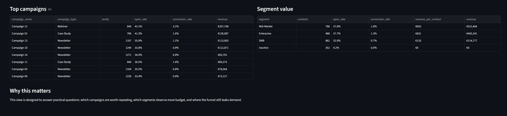

# PipelineIQ

Lead-to-Revenue Intelligence Platform (portfolio project)

PipelineIQ simulates and analyzes how marketing activity moves through a practical business funnel:

campaign -> send -> engagement -> lead progression -> conversion -> revenue

This is a public portfolio repository built with synthetic data only. No confidential, personal, employer, or real customer data is used.

## Current project status

PipelineIQ is now in a solid v1 state.
It already includes a reproducible synthetic data pipeline, tested funnel metrics, monthly trend reporting, explicit last-touch attribution, decision-support outputs, and a Streamlit dashboard for exploring campaign, segment, region, and campaign-type performance.

## Why this project exists

The project should make three things clear quickly:

1. It models business workflows, not random charts.
2. The analytics answer useful decisions, not only technical curiosities.
3. The code is clean, testable, and safe for a public repository.

## Tech stack (v1)

This is the starting stack, not a permanent rule. If the project needs a different tool later, the stack can change.

- Python
- pandas
- DuckDB
- Streamlit
- pytest

## What this project helps answer

- Which campaigns are worth repeating?
- Which lead segments deserve more budget?
- Where do leads drop out of the funnel?
- Which audiences are underperforming or inactive?
- Which regions and campaign types create the most value?
- Which campaigns are actually getting credit for won revenue under a clear attribution rule?
- What should the business do next based on the current results?

## Dashboard preview

### KPI, funnel, and next-action view



This view gives a quick read on overall revenue, funnel drop-off, and the most practical next actions.

### Campaign and segment comparison view



This view makes it easier to see which campaigns are worth repeating and which segments are most valuable.

## Repository structure

- `data/`: local generated outputs
- `pipelines/`: runnable pipeline scripts
- `analytics/`: analysis notes and future SQL assets
- `dashboard/`: Streamlit dashboard for business-facing review
- `tests/`: data and metric tests
- `docs/`: public project documentation and screenshots
- `src/pipelineiq/`: core Python modules and metric logic

## Quick start

Use Python 3.10 or newer.

### 1. Create and activate a virtual environment

```powershell
python -m venv .venv
.\.venv\Scripts\Activate.ps1
```

### 2. Install dependencies

```powershell
pip install -e .[dev]
```

### 3. Run the pipeline

```powershell
python pipelines/run_pipeline.py
```

### 4. Run the dashboard

```powershell
streamlit run dashboard/app.py
```

### 5. Run tests

```powershell
pytest
```

## Initial outputs

The pipeline writes CSVs and a DuckDB file under `data/processed/`.
These are generated locally when you run the project and are not intended to be committed as source artifacts.

- `contacts.csv`
- `campaigns.csv`
- `email_sends.csv`
- `email_events.csv`
- `lead_progression.csv`
- `conversions.csv`
- `opportunities.csv`
- `revenue_events.csv`
- `funnel_kpis.csv`
- `campaign_performance.csv`
- `campaign_attribution.csv`
- `segment_performance.csv`
- `region_performance.csv`
- `campaign_type_performance.csv`
- `recommended_actions.csv`
- `pipelineiq.duckdb`

## What is included right now

The current version already covers the main pieces of the project:

- synthetic CRM-style data generation across contacts, campaigns, sends, events, lead stages, conversions, opportunities, and revenue
- realistic targeting fields for segment, region, industry, and engagement level
- funnel, campaign, segment, region, and campaign-type reporting
- monthly trend reporting for sends, engagement, conversions, and revenue
- explicit last-touch attribution for won revenue by campaign
- a recommendation layer that turns the metrics into practical next actions
- a lightweight dashboard for exploring the outputs without digging through raw files
- tests that check synthetic data realism and metric sanity

## Business questions the project can already answer

- Which campaign types have better click and conversion performance?
- Is performance improving month to month, or are results concentrated in one short spike?
- Which campaigns are driving won revenue under the project's attribution rule?
- Which segments move from MQL to SQL most effectively?
- Which segments create the most revenue per contact?
- Which regions and campaign types perform best?
- What is the rough conversion yield from sends to revenue?
- What action should the business take next based on current funnel bottlenecks?

## Dashboard

A lightweight Streamlit dashboard is included in `dashboard/app.py`.
It surfaces the main KPIs, monthly momentum, attributed revenue drivers, campaign and segment comparisons, region and campaign-type views, funnel drop-off, and recommended next actions in one place.

## Attribution assumption

PipelineIQ uses a simple last-touch attribution rule for won revenue.
In this project, that means won revenue is credited to the campaign attached to the conversion record, which represents the most recent clicked campaign in the synthetic funnel.
The goal is clarity and explainability, not a claim that one attribution model is universally correct.

## How to use the dashboard

1. Start with the KPI cards to check overall revenue, open rate, click-to-open rate, and conversion rate.
2. Review the funnel chart to see where leads drop off between sends, engagement, MQL, SQL, and won deals.
3. Compare the top campaign table to spot which campaign types are worth repeating.
4. Compare the segment table to see which audiences create the most value.
5. Use the recommendation panel as a plain-language guide for what to improve next.

## Safety and quality notes

- Synthetic data only
- No hardcoded secrets or credentials
- No external CRM, ESP, or warehouse connection is required to run the project
- Generated CSV and DuckDB outputs stay local under `data/processed/`
- Deterministic generation with seed support
- Tests included for funnel realism, segment behavior, and metrics
